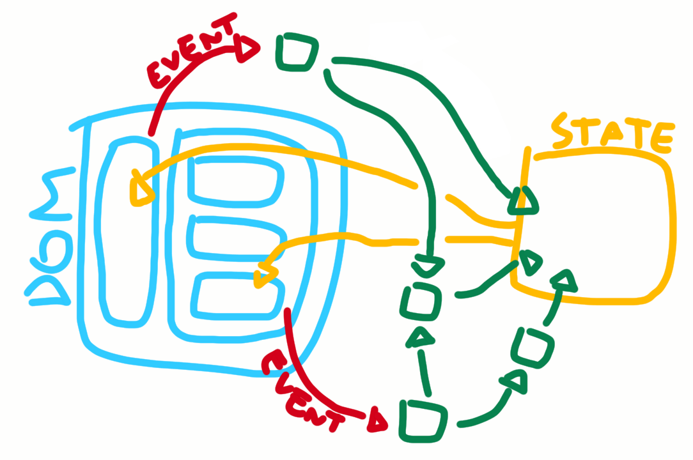
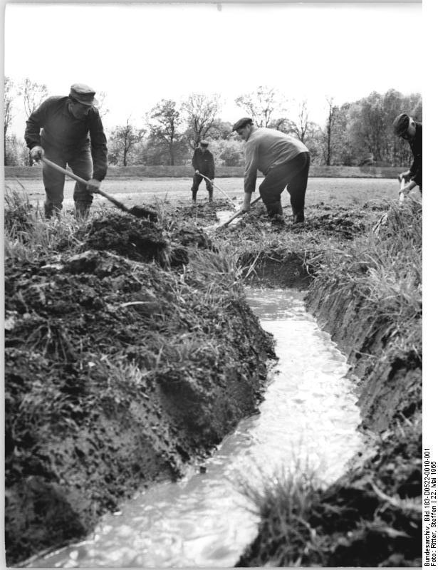

**dreno** (portuguese for _drain_) is a small framework that combines the functional-reactive approach of [Cycle.js](https://cycle.js.org/) with the simplicity and scalability of state management given by [MobX](https://github.com/mobxjs/mobx).

## why?

Because it had to be done. Read more about it [here](docs/why.md).

## how does it work?

Basically, you render some components with [React](https://facebook.github.io/react/) while accessing values from a **state** that is given by the `observable` function. Whenever the components emit events you want to react to, you `track` these events. Any tracked event can be accessed from the `select` function as a [xstream](https://github.com/staltz/xstream) stream. From the streams given by `select` and any other streams you may create (for example, for accessing external or browser APIs) you should be able to deduce the values that will then be passed to `observable`.

[](docs/why.md)

See some simple live [examples](http://rawgit.com/fiatjaf/dreno/master/examples/) with the code used to generate them.

## getting started

```
npm install dreno
```

You may start your app by copypasting the following [boilerplate](http://rawgit.com/fiatjaf/dreno/master/examples/#/add-one):

```js
// app.js

const ReactDOM = require('react-dom')
const {observer, observable, track, select} = require('dreno')

const state = observable({
  /* attributes that will be accessed
   * directly from the components
   * go here.
   *
   * count: select('a.add-one')
   *   .events('click')
   *   .mapTo(1)
   *   .fold((acc, s) => acc + s, 0)
   *   .startWith(0)
   */
})

const MainComponent = observer(
  /* any React component class, either a stateless function,
   * a class inheriting from React.Component or created with
   * 'create-react-class'.
   *
   * only remember to set the event handlers to `track`,
   * like <a href='#' className='add-one' onClick={track}>click here to add 1</a>
   */
)

ReactDOM.render(
  MainComponent,
  document.getElementById(/* your react root element */)
)
```

Apart from that, you can do all the usual React stuff, transpilation etc.

---

Some germans performing drainage:



based on an idea first exposed at https://gist.github.com/fiatjaf/ece86e33b1f8846c8f8c318778b0895a.
