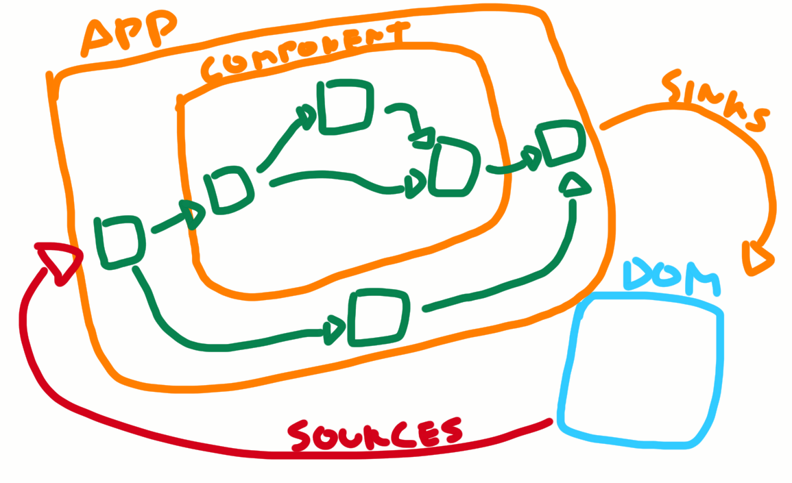
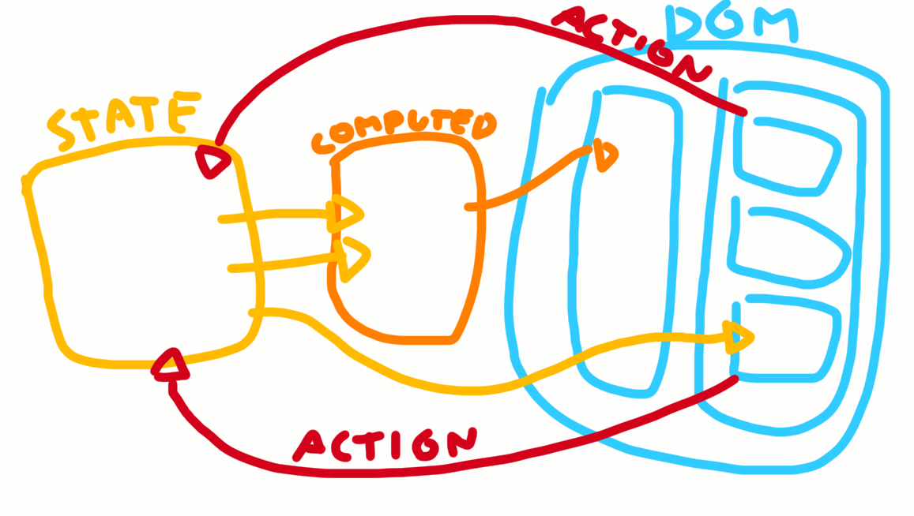
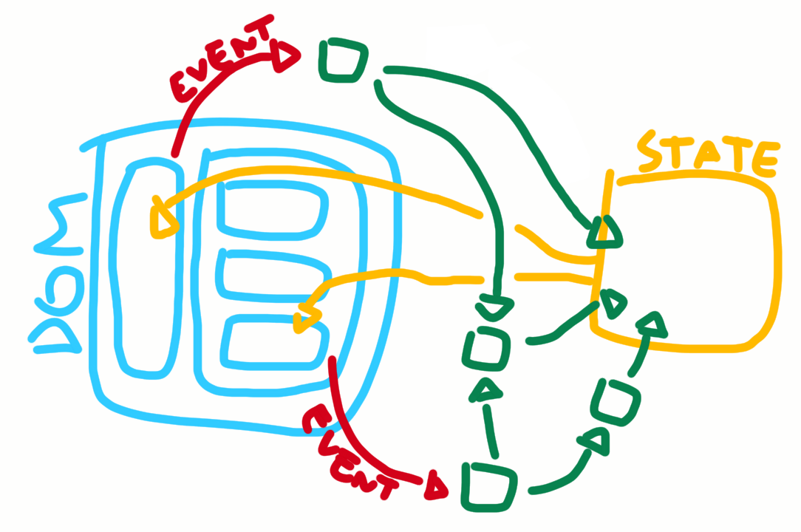

# the rationale behind _dreno_, or an introduction, or a long argument to convince you to use it

## cycle.js

How does [Cycle.js](https://github.com/cyclejs/cyclejs) work? There are multiple _drivers_ you can (and must) use, everything that has side-effects is in a driver and the drivers pass data to the _main app function_, which is pure. That function returns data to the drivers. The driver that renders the DOM and emits DOM events to the main function is normally the most important driver of any Cycle application.

In Cycle, dealing with data from multiple sources (in the diagram I didn't draw any other _sources_, but HTTP responses and browser API responses also go through the red arrow) is easy and straightforward. Everything is a value and every value can be processed in any way you want inside the **pure dataflow** app function, and the results of that function are everything that is needed to render the UI, or any other side-effect.

The reactive streams approach is solid and flexible. You can do any kind of data manipulation in a clean way with it. The way data flows in a Cycle app is beautiful. [xstream](https://github.com/staltz/xstream) makes it even better, for it is small and easy to understand, and still very powerful.

## mobx

Now, how does [MobX](https://github.com/mobxjs/mobx) work? Basically there's a lot of magic and fancy words, but essentially, when you're using it with React, it goes like this:

There are your React components that are rendered into the DOM, each component is set by MobX to track some of the state's attributes they access. From DOM events or from any other external event (like HTTP responses) you trigger _actions_ that update the state, then MobX does internal magic to call `.forceUpdate` on the components that were tracking any of the attributes that changed.

All the `computed` stuff and other runtime triggers like `when` are just sugar that some people may find useful, but they're not the core feature. The core feature is having your components update automatically. And, more than that, having _only the components that were to get new values from the state to actually update_.

## problems with mobx and cycle.js

One problem with MobX is that it can get pretty messy. You can set state directly from your components event handlers, or you can define an `action` in the _state_ itself and then make the event handlers call those actions. In the first approach you'll end up with a confusion of state setters everywhere and you can't reasonably visualize your app; in the second approach you'll end up with a lot of predefined actions for stupid small changes, everything will look like a bloated object-oriented architecture. In real-world small apps you'll maybe end up mixing the two approaches, which is even worse. Not to mention that you can create anonymous actions on the fly, just to use their _transaction_ power.

Modifying state, on the other side, is the core feature of Cycle. Notice how there's not even a _state_ in the Cycle diagram. That's because your state in Cycle is just all your streams and their output values (you can surely combine all the streams in a single stream an call it `state$`, but that's not necessary). In Cycle.js you don't need MobX's `compute`, you can just `.map()` over streams; you don't need `reaction`, you can just pass some stream values to a driver.

However, notice how the DOM part is small in the Cycle diagram. That's because in Cycle DOM is just a driver. Cycle puts so much emphasis on the pure logic part that it kinda forgets about the complexities of DOM rendering. So every time the "state" in Cycle changes the DOM must be updated by the driver -- and if some optimization in the DOM rendering can be done, it is somewhat alien to the Cycle app. One crucial optimization is using a virtual DOM and patches instead of writing to `.innerHTML` (that's assumed by default in this post-React world we live in), other optimizations like _not even rendering a part of the virtual DOM tree if some part of the state have not changed_ is left to the the driver and the app function passing the correct values to the driver.

MobX has a better solution to that. Having a tree of nested components and triggering automatic updates only of those leafs which actually have to change, as I said before, is its strongest feature that almost makes _thunks_ and usage of _shouldComponentUpdate_ unnecessary.

## dreno

Dreno takes the flexibility and transparency of the stream-based dataflow from Cycle.js, combines it with the ease of view composing in standard React powered by MobX-like state plus the efficient nested component updates the observer/observable pattern from MobX introduced and gives us something like this:

In a Dreno app you can put your dataflow logic anywhere. I like to imagine it floating around the view and the state. You use the `select` function (like [@cycle/dom](https://cycle.js.org/api/dom.html)'s `select`) to get events streams from DOM events, and you also create your own event streams from other external interfaces, then you map the values using [xstream](https://github.com/staltz/xstream) reactive streams until you pass the final streams (of which you want the output) to `observable()`, that gives you a _state_ whose properties are updated every time their respective streams emit a new value.

You can access the properties of _state_ as if they were normal object properties from inside your React components, but every time a component accesses a property, Dreno will know it must trigger a `forceUpdate` on that component the next time this property changes. Since it is handled automatically by the library, you don't have to worry about it while writing you **pure dataflow** logic.

There's no much more than that.

## the downsides

You lose the fractal structure: your apps are not composable, like Cycle or [Elm Architecture](https://guide.elm-lang.org/architecture/) apps are. You can't embed an app built with Dreno inside another app built with Dreno. There are cases in which you want to do that, but there are many cases when you don't. You can still embed external React components inside your view, with all their own peculiar intra-React state management, it's not the same thing, but still you get to reuse those small components React people wrote with reusability in mind, that's good.

You lose the Cycle pureness, since now you have a state that effectively caches the final results of your streams, and you also have to interface with the external world without the help of Cycle drivers (but you surely can implement these -- or even reuse Cycle drivers -- here).
